# EWS Anomaly Detection Architecture

Bu dokuman Ticari Orta Faz 1 icin aktif, calisan akisi anlatir. Kapsam:

- `bank_total_risk >= 1_000_000`
- `segment = TICARI_ORTA`
- `is_balance_sheet_customer = 1`
- `has_pos = 1`
- yalnizca Faz 1'in 13 nihai business degiskeni

## Faz 1 Akis

```mermaid
flowchart LR
    A["01 Native Input<br/>Oracle native_features<br/>ay sonu snapshotlari"] --> B["02 Cohort Filter<br/>Ticari Orta + >1m risk + bilancolu + POS"]
    B --> C["03 Materialization<br/>base featurelar + self history + trend + population reference"]
    C --> D["04 Derived Input Table<br/>Oracle input_features<br/>DATA_TIME ile overwriteable snapshot"]
    D --> E["05 Development Windows<br/>train / test / calibration / oot"]
    E --> F["06 Preprocessing<br/>missing handling + hard bounds + winsor + robust scaler"]
    F --> G["07 Feature Elimination<br/>coverage / duplicate / correlation / branch routing"]
    G --> H["08 Ensemble Training<br/>AE + Isolation Forest + Mahalanobis"]
    H --> I["09 Calibration and Validation<br/>unsupervised stability + supervised outcome check varsa"]
    I --> J["10 Registry and Promotion<br/>candidate / champion / run_id bazli runtime"]
    J --> K["11 Monthly Scoring<br/>her ayin 1. gunu onceki ay sonu snapshot"]
    K --> L["12 Oracle Outputs<br/>results + details + full_effects + monitor_history"]
    L --> M["13 Monitoring<br/>quality + PSI + band persistence + health status"]
```

## Step Aciklamalari

### 01. Native Input

- Oracle `native_features` tablosu ay sonu grain ile beslenir.
- Native tablo sadece ham alanlari icerir; feature engineering burada yapilmaz.
- `snapshot_date` ve `customer_id` primary grain'dir.

### 02. Cohort Filter

- Materialization sirasinda portfolio filtresi merkezi olarak uygulanir.
- Faz 1 modeline yalnizca uygun cohort girer; native tabloda kapsam disi musteri bulunabilir.

### 03. Materialization

- 13 base degisken native alanlardan uretilir.
- Her base degisken icin final long list su aileleri icerir:
  - `__delta_1`
  - `__self_zscore_6`
  - `__trend_slope_6`
  - `__population_percentile`
  - `__vs_population_median_delta`
- Warm-up nedeniyle ilk `18` snapshot derived tabloda tutulmaz.

### 04. Derived Input Table

- Oracle `input_features` tablosu final model kolonlarini tutar.
- Ayni snapshot tekrar skorlaniyorsa ilgili scope silinip yeniden yazilir.
- `DATA_TIME` kolonu o derived scope'un insert zamanini saklar.

### 05. Development Windows

- Derived tarihcesi train / test / calibration / oot pencerelerine ayrilir.
- Tum split'ler config-driven olarak lifecycle tarafinda resolve edilir.

### 06. Preprocessing

- Missing handling feature-semantic kurallarla yapilir.
- Hard bounds yalniz zorunlu yönsel alanlarda uygulanir.
- Winsorization ve `RobustScaler` ensemble oncesinde ortak donusum katmanidir.

### 07. Feature Elimination

- Low coverage kolonlar elenir.
- Exact duplicate kolonlar elenir.
- Yuksek korelasyonlu kolonlarda baz degisken turevlerine tercih edilir.
- Branch routing ile Mahalanobis binary kolonlari disarida birakabilir.

### 08. Ensemble Training

- `Autoencoder`
- `Isolation Forest`
- `Mahalanobis`

Bu uc model ayni final shortlist uzerinden calisir; ensemble agirliklari config ve/veya tuning sonucu kullanilir.

### 09. Calibration and Validation

- Calibration `calibration` window'u uzerinden yapilir.
- Unsupervised validation:
  - score distribution
  - KS
  - mean ratio
  - PSI
- Outcome varsa supervised validation:
  - precision@top%
  - recall@top%
  - f1@top%
  - lift@top%

### 10. Registry and Promotion

- Her run ayri `run_id` ile tutulur.
- Candidate ve champion state `runtime/registry` altinda tutulur.
- Model artifact, calibration, stability, feature selection ve evaluation dosyalari `runtime/models` ve `runtime/runs/<run_id>` altinda saklanir.

### 11. Monthly Scoring

- Batch schedule: her ayin `1.` gunu saat `08:00`.
- Default selector: `previous_month_end`.
- O ay icin ilgili ay sonu snapshot yoksa run `skipped` olur; hata vermez.

### 12. Oracle Outputs

- `results`: score, band, top 3 reason
- `details`: top reason satirlari
- `full_effects`: tum feature etkileri
- `monitor_history`: run-level trend ve health kaydi

### 13. Monitoring

- Quality gates native ve derived seviyede calisir.
- Health status `GREEN / YELLOW / RED` olarak uretilir.
- Monitoring bundle dosyalari `runtime/runs/<run_id>/monitoring` altina yazilir.
- Aylik run'lar bir onceki run ile kiyaslanabilir:
  - score PSI
  - kirmizi band persistence
  - dominant top reason

## Runtime Yerlesimi

- `runtime/registry`: run, model, champion registry
- `runtime/runs/<run_id>`: manifest, log, monitoring, run-local outputs
- `runtime/models`: re-usable model artifacts
- `runtime/logs/cli`: CLI session loglari

## Operasyonel Giris Noktalari

- Notebook: [notebooks/ticari_orta_faz1_execution_simulation.ipynb](/C:/Users/Acer/ews-anomaly-detection/notebooks/ticari_orta_faz1_execution_simulation.ipynb)
- CLI:
  - `python cli.py prepare-ticari-orta-faz1-demo`
  - `python cli.py develop`
  - `python cli.py tune-weights`
  - `python cli.py evaluate-outcomes`
  - `python cli.py promote`
  - `python cli.py score-live`
  - `python cli.py run-batch`
