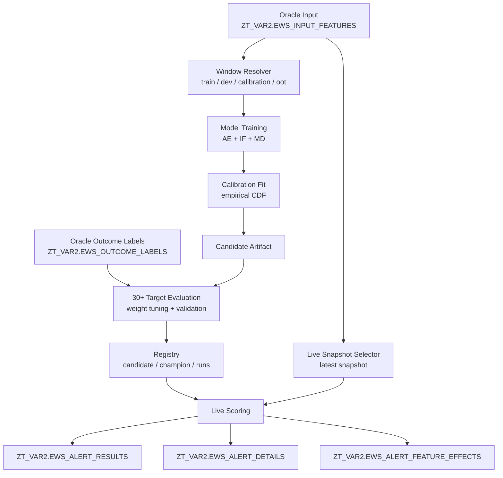
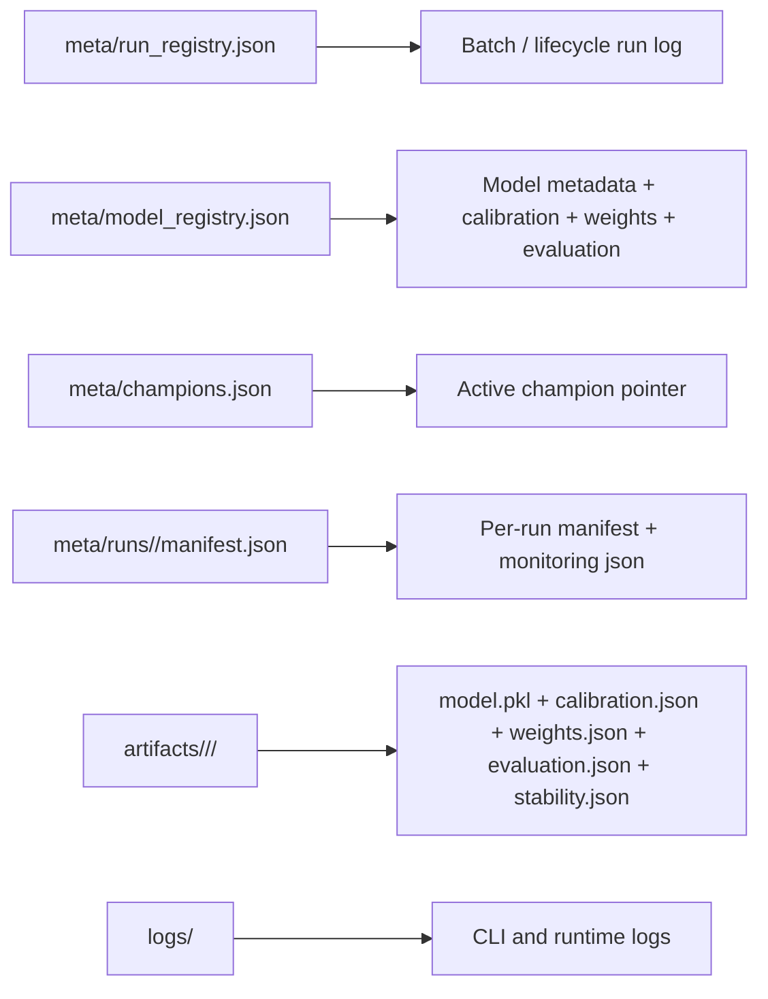

# EWS Lifecycle Architecture

Bu proje Oracle-first, config-driven ve batch orchestrated anomaly lifecycle olarak calisir.

## High-Level Flow



## Batch Execution

`cli.py run-batch` config icindeki `batch_execution` bolumune gore su akisi yonetir:

1. Champion yoksa bootstrap `develop`
2. Gerekirse `tune-weights`
3. Gerekirse `evaluate-outcomes`
4. Gerekirse bootstrap `promote`
5. `score-live`

Champion varsa steady-state batch akisi:

1. `score-live`
2. `retrain` veya `develop` ile challenger uret
3. `tune-weights`
4. `evaluate-outcomes`
5. `compare`
6. Config isterse `promote`

## Oracle Tables

### Inputs

- `ZT_VAR2.EWS_INPUT_FEATURES`
  Tek append-only feature tablosu. Development ve live scoring ayni kaynaktan okunur.
- `ZT_VAR2.EWS_OUTCOME_LABELS`
  Outcome tablosu. Weight tuning ve validation icin `30+` primary, `default` monitoring olarak kullanilir.

### Outputs

- `ZT_VAR2.EWS_ALERT_RESULTS`
  Musteri-snapshot seviyesinde ozet skor, band ve metadata.
- `ZT_VAR2.EWS_ALERT_DETAILS`
  Alert alan musteriler icin top-N hizli explainability satirlari.
- `ZT_VAR2.EWS_ALERT_FEATURE_EFFECTS`
  Tum feature efektleri, human-readable uzun format explainability tablosu.

## Local Runtime State



## Manual Reset

Local runtime state'i temizlemek icin:

```bash
python cli.py reset-runtime
```

Bu komut:

- `logs/`
- `artifacts/`
- `meta/runs/`
- `meta/monitoring/`

temizler ve registry dosyalarini sifirdan olusturur. Oracle tablolari silmez.

## Airflow Entry Point

`orchestration/airflow/ews_batch_dag.py` tek giris noktasi olarak `cli.py run-batch` cagirir. Boylece scheduling katmani ince kalir; is mantigi uygulama icinde kalir.
