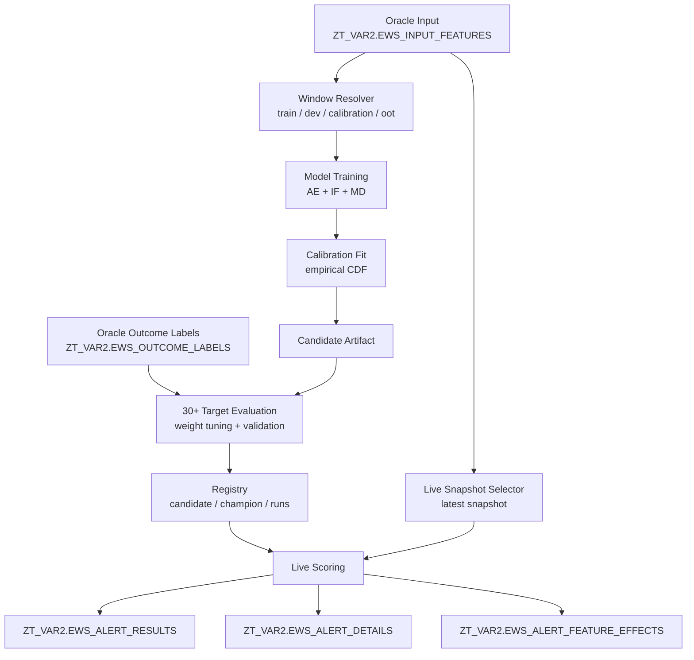
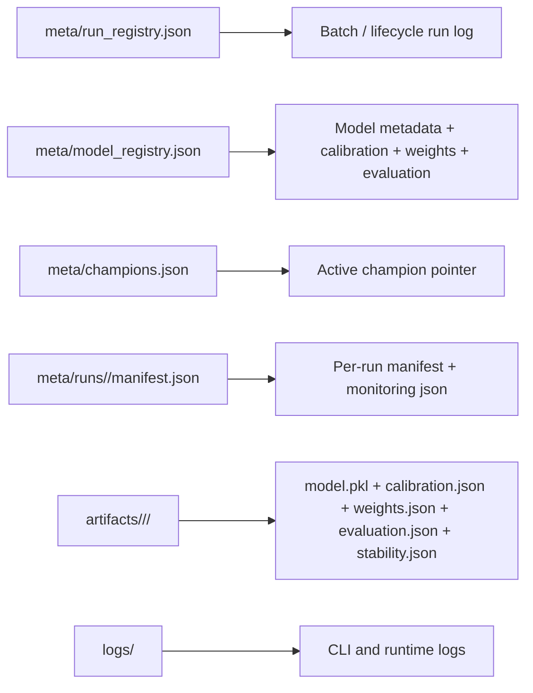

# EWS Lifecycle Architecture

Bu proje Oracle-first, config-driven ve batch orchestrated anomaly lifecycle olarak calisir.

## High-Level Flow



## Batch Execution

`cli.py run-batch` config icindeki `batch_execution` bolumune gore su akisi yonetir:

1. Champion yoksa bootstrap `develop`
2. Gerekirse `tune-weights`
3. Gerekirse `evaluate-outcomes`
4. Gerekirse bootstrap `promote`
5. `score-live`

Champion varsa steady-state batch akisi:

1. `score-live`
2. `retrain` veya `develop` ile challenger uret
3. `tune-weights`
4. `evaluate-outcomes`
5. `compare`
6. Config isterse `promote`

## Oracle Tables

### Inputs

- `ZT_VAR2.EWS_INPUT_FEATURES`
  Tek append-only feature tablosu. Development ve live scoring ayni kaynaktan okunur.
- `ZT_VAR2.EWS_OUTCOME_LABELS`
  Outcome tablosu. Weight tuning ve validation icin `30+` primary, `default` monitoring olarak kullanilir.

### Outputs

- `ZT_VAR2.EWS_ALERT_RESULTS`
  Musteri-snapshot seviyesinde ozet skor, band ve metadata.
- `ZT_VAR2.EWS_ALERT_DETAILS`
  Alert alan musteriler icin top-N hizli explainability satirlari.
- `ZT_VAR2.EWS_ALERT_FEATURE_EFFECTS`
  Tum feature efektleri, human-readable uzun format explainability tablosu.

## Feature Inference And Categorical Config

Varsayilan davranis:

- `pipeline.id_column` ve `pipeline.time_column` feature degildir.
- Bunlar disindaki numeric kolonlar otomatik feature olarak infer edilir.
- Kategorik kolonlar varsayilan olarak modele girmez.

Bir kategorik kolonu modele dahil etmek istersen `features.categorical.per_feature` altinda acikca tanimlarsin. `transforms` alani her zaman YAML liste formunda yazilir:

```yaml
features:
  mode: infer
  categorical:
    default_include: false
    low_cardinality_threshold: 8
    per_feature:
      risk_band:
        include: true
        transforms:
          - ordinal
          - is_unseen
        order:
          - low
          - medium
          - high
      channel:
        include: true
        transforms:
          - one_hot
          - rarity
```

## Train-Only Sampling

Sampling sadece `development.train` penceresinde calisir. `dev`, `calibration`, `oot` ve `live scoring` full data ile devam eder.

Varsayilan mantik:

- `development.sampling.enabled: false`
- `activate_if_rows_gt` esigi gecilmezse sample alinmaz
- sample alindiginda zaman, missing ve tail dagilimi korunmaya calisilir
- validation fail ederse sistem full train'e geri doner

Ornek config:

```yaml
development:
  sampling:
    enabled: true
    activate_if_rows_gt: 1000000
    max_rows: 500000
    compare_max_rows: 5000
    tail_z_threshold: 3.5
    random_seed: 42
    validation:
      max_snapshot_share_delta: 0.02
      max_tail_share_delta: 0.02
      max_missing_share_delta: 0.02
      max_feature_missing_delta: 0.01
      max_feature_ks: 0.10
      fallback_to_full_on_fail: true
```

Karsilastirma icin:

- `python cli.py compare-sampling [segment]`

Bu komut baseline vs sampled train kosusunu karsilastirir ve `sampling_comparison.json` ile `sampling_comparison.md` uretir.

Desteklenen kategorik transformlar:

- `one_hot`
- `freq`
- `rarity`
- `is_unseen`
- `changed_from_prev`
- `ordinal`

## Local Runtime State



## Manual Reset

Local runtime state'i temizlemek icin:

```bash
python cli.py reset-runtime
```

Bu komut:

- `logs/`
- `artifacts/`
- `meta/runs/`
- `meta/monitoring/`

temizler ve registry dosyalarini sifirdan olusturur. Oracle tablolari silmez.

## Airflow Entry Point

`orchestration/airflow/ews_batch_dag.py` tek giris noktasi olarak `cli.py run-batch` cagirir. Boylece scheduling katmani ince kalir; is mantigi uygulama icinde kalir.
